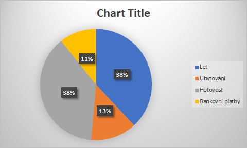
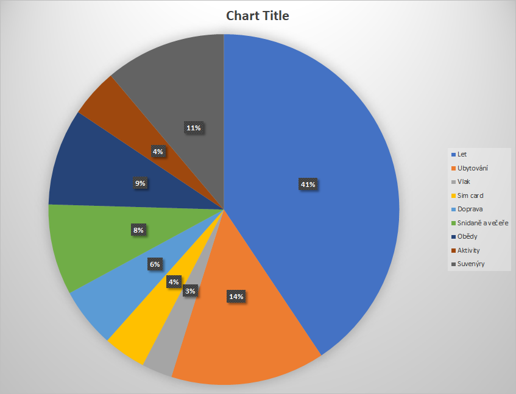

# Rozpočet pro cestu do japonska
Celý výlet začal 29.8. a končil 10.9.
Doba v japonsku = 12 dní kde poslední a první jenom půlka (dá se říct tedy 11 dní)
Směněno 14 955 Kc = 66 000 yen, 3 300 yen zbylo
(Pro příklad u banky byste k dnešnímu datu 22.6.2021 dostali za 14 955 Kc = 74 292 yen)

## Letenky
Cesta byla z Prahy přes Italii
### Cesta tam
- odlet: 29.8. 12:05
- přílet: 30.8. 10:30
### Cesta zpět
- odlet: 10.9. 12:35
- přílet: 10.9. 18:15

Cena letu: 608,10 $ = 14 254,16 Kc

## Ubytování
Ubytování bylo velmi malé, ale obsahovalo všechno potřebné
- pro 11 nocí (12 dní)
- Check-in: 30.8. 17h
- Checkout: 10.9. 10h
- cena 14 959,17 pro tři osoby = 4 986 Kc
- tedy 453 kc na noc pro jednoho

## Ostatní cestovní útraty
- směněno 14 955 Kc = 66 000 yen, 3 300 yen zbylo
- vlak do prahy 115 Kc
- Keisei skyliner z letiste do tokia 2470 yen = 567 Kc a zpět 1 857 = 421 Kc
- Sim card s neomezeným internetem 5980 yen = 1 376 Kc

## Doprava v japonsku
Používaná byla suica asi nejlepší způsob placení za dopravu v Tokiu
Dá se koupi skoro na všech zastávkách, záloha je 500 yen a dobijí se hotovostí (S I-phonem je mozne mít kartu v něm, na androidu ne)
- Zakoupena suica s nabitím za 10 000 yen, tedy 500 záloha a 9 500 na kartě
- během dovoléné poté bylo ještě jednou nabito 5 000 yen
- celkově tedy na útratu a cestování 14 500 yen a zbylo 437 yen 
- tedy bylo použito 14 063 yen
- Z toho na doprava bylo použito 9 907 yen = s dnešním kurzem okolo 1 938 Kc

Cena cesty pro jednotlivé dny
- 1 den 371 yen
- 2 den 1 022 yen
- 3 den 412 yen
- 4 den 800 yen
- 5 den 742 yen
- 6 den 1 614 yen
- 7 den 812 yen
- 8 den 967 yen
- 9 den 1 132 yen
- 10 den 800 yen
- 11 den 864 yen
- 12 den 371 yen

Průměr na den tedy byl 825 yen na den tedy s dnešním kurzem 161 Kc (směna u banky 187 Kc)

## Obecné útraty
Je těžké toto přesně odhadnout, velká část věcí byla placena hotovostí kvůli tomu že je preferována, hodím sem tedy přesná čísla útrat ze suica a bankovní karty
#### Suica
- Platby v automatech 1 270 yen = 248 Kc
- Platba v obchodě (Hlavně tedy jídlo) 2 622 yen = 513 Kc

#### Bankovní účet
- Platba v obchodě (Hlavně tedy jídlo) 6 422 yen = 1 464 Kc (Dnešní kurz 1 256 Kc)
- Ostatni platby ktere byli uvedeny v [[JAPAN budget#Ostatní cestovní útraty]]

### Shrnutí útrat za jídlo a pití
Jídlo byl rozděleno tak, že snídaně a věčeře byli nakoupeny jako hotová jídla v obchodě a oběd byl v restauraci, pití bylo nakupováno buďto v obchodě, restauraci nebo v automatech.
Snídaně a věčeře z obchodu byli větišinou nakoupeny večer spolu. 
##### Snídaně a večeře
Dny kdy bylo zaplaceno v obchodě zaplaceno kartou nebo suica:
- 30.8. 997 yen suica
- 31.8. 1 127 yen
- 1.9. 1 210 yen
- 3.9. 1 177 yen
- 4.9. 1 151 yen
- 5.9. 752 yen
- 6.9. 921 yen suica
- 8.9. 1 005 yen
- 10.9. 357 yen suica (bylo na letišti)

Takto to vychází, že průměrně se utratilo na večer 1 055 yen (bez platby na letišti) = okolo 227 Kc (dnesni kurz 206 Kc)
Proto zbylé dny kdy nebylo placeno kartou nebo suica tak bylo placeno hotovostí, dohromady tedy okolo 6 303 yen a celkově 15 000 yen za večeře a snídaně (v tom je započítáno aji pití) = okolo 2 935 Kc

##### Obědy
Obědy byli všechny placeny hotovostí proto odhad kolik stály není úplně přesný.
Podle odhadu stály obědy mezi 700 až 1 200 yen k obědu bylo někdy dokoupeno aji nějáké pití většinou okolo 300 až 600 yen. 
Průměr na den by teda mohl být okolo 1 500 yen (aji s pitím) = 293 Kc.
Na celý výlet bychom tedy mohli dát útratu na oběd okolo 16 000 yen = 3 130 Kc na 11 dní (toto je podle mě částka víc než je potřeba ale bylo by možné opravdu zajít dá se říct do všech různých retaurací)

### Útraty za suvenýry a aktivity
Toto je opět sekce kde je velmi těžké uvést útratu, můžeme zde brat v potaz kolik bylo utraceno za ostatní věci. To by mohlo vycházet na 30 000 yen = okolo 5 870 Kc, myslím si, že od této částky bychom ale měli ještě odečíst část. Kvůli nákupu pití a potravin, plus ještě část peněz nebyla utracena (3 300 yen). Proto si myslím, že konečná částka by mohla být okolo 27 000 yen = okolo 5 283 Kc.
##### Aktivity
Za aktivity se moc neplatilo, většina turistických míst je zadarmo. Hlavní útrata zde tedy byla návštěva SkyTree 3 100 yen a průvodce pro Akihabaru asi okolo 4 000 yen (toto je opravdu jenom odhad, nemám žádný záznam o tom kolik to mohlo stát). 
Takže na aktivity vychází cena okolo 8 000 yen = okolo 1 565 Kc.
##### Suvenýry
Zde bylo utraceno mnohem víc než v sekci Aktivity. Zároveň je to ale sekce která se dá asi nejjednodušeji ovládat. Jde opravdu o to co je cílem výletu. 
Skusím tedy jenom nastínit kolik jsem nakupoval já ale zase cena je velmi obecná.
Ohledně suvenýrů jsem nakoupil opravdu velké množství jak pro sebe tak pro známé cena by tedy mohla být okolo 20 000 yen = okolo 3 913 Kc.
Jen pro představu malý suvenýr výjde tak na 200 až 600 yen = 39 až 117 Kc.

## Souhrn útrat
Souhrn kolik tedy bylo dohromady a za co utraceno.
- Let 14 254 Kc
- Ubytování 4 986 Kc
- Hotovost 14 955 Kc - okolo 750 Kc z penež co zbylo = 14 205 Kc
- Bankovní platby 3 987 Kc

Dohromady tedy celý výlet stál okolo 37 432 Kc. (S dnešním kurzem 22.6.2021 koruny by výlet vyšel na hodnotu okolo 34 000 Kc)
Na den 1 931 Kc bez letu a s ubytováním.

A rozdělení podle sekcí (vychází dohromady méně kvůli kurzu a některé části nemohli být kompletně správně vypočitané):
- Let 14 254 Kc
- Ubytování 4 986 Kc
- Vlak z a na letiště 988 Kc
- Sim card 1 376 Kc
- Doprava 9 907 yen = s dnešním kurzem okolo 1 938 Kc
- Snídaně a večeře 15 000 yen = okolo 2 935 Kc
- Obědy 16 000 yen = 3 130 Kc
- Aktivity 8 000 yen = okolo 1 565 Kc
- Suvenýry 20 000 yen = okolo 3 913 Kc

## Shrnutí na konec
Na konec bych tedy chtěl jenom říct, že opravdu největší část rozpočtu je cena letu a pokud je možné tak je dobré sehnat opravdu nejvýhodnější let.
Rozpočet se dá následně také rozdělit jinak, záleží co čekáté od výletu. Můžete utrati více za jídlo pokud chcete aji večeřet v restauracích nebo můžete utratit méně za suvenýry a ušetřit tak. 
Jenom bych chtěl říct, že v této situaci bych asi minimální rozpočet kde si to pořát můžete plně užít viděl na částku okolo 30 000 Kc. Již jsem nastínil na sekcích na kterých se může ušetřit (Aktivity, suvenýry, jídlo, Sim card)